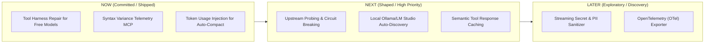

# Consolette Product Strategy, Competitive Analysis & Backlog Roadmap

## 1. Executive Summary & Product Vision

**Product Vision**: Consolette is the ultra-fast, local-first LLM router and context-optimization proxy tailored for agentic developer workflows (Claude Code, OpenCode, Cursor, and MCP tools).

Unlike general cloud-first API gateways (e.g. LiteLLM, Portkey), Consolette operates as a zero-latency single Rust binary daemon on the developer's machine, intelligently bridging Anthropic, Bedrock, OpenAI, OpenRouter, Gemini, and local models while clamping context budgets, compressing MCP schemas, and repairing open-weight model tool execution.

---

## 2. Competitive Proxy Analysis & Market Positioning

| Feature / Dimension | **Consolette** | **LiteLLM Proxy** | **OpenRouter** | **Portkey / Helicone** | **One API / New API** |
| :--- | :--- | :--- | :--- | :--- | :--- |
| **Architecture / Stack** | Single Rust Binary (<10MB) | Python / FastAPI (~150MB) | Hosted SaaS | Cloud API Gateway / SaaS | Go Binary |
| **Latency Overhead** | Sub-millisecond (<0.5ms) | 15–50ms | N/A (Hosted) | 10–30ms | 2–5ms |
| **Local / Offline First** | ✅ Native (systemd/launchd) | ⚠️ Docker/Python | ❌ Cloud only | ❌ SaaS | ⚠️ Self-hosted Go |
| **Claude Code & MCP Native** | ✅ Deep (`mcp-proxy`, `cmdcrush`, token clamping) | ❌ None | ❌ None | ❌ None | ❌ None |
| **Open-Model Harness Repair** | ✅ System prompt tool bridge & schema sanitization | ❌ None | ⚠️ Basic schema pass | ❌ None | ❌ None |
| **Dynamic Model Routing** | ✅ Weighted, Fallback, `model_family` prefix | ✅ Load balance, fallback | ✅ Auto-router | ✅ Fallback / Retry | ✅ Channel weighting |
| **Context & Cost Telemetry** | ✅ Local SQLite, `/dashboard`, Syntax Variances | ⚠️ PostgreSQL / Redis | ⚠️ Account Dashboard | ✅ Enterprise Analytics | ⚠️ Basic token logs |

### Key Differentiators (Consolette's Moat)
1. **Developer CLI & Agent Native**: Seamlessly handles Claude Code auto-compaction trigger (`with_input_tokens`), context budget clamping (`clamp_context_budget`), and MCP schema compression (`mcp-proxy`).
2. **Open-Weight Model Bridge**: Fixes the tool breakdown where open models (Qwen, Llama, DeepSeek) reject Claude Code's Anthropic system prompts and complex tool schemas.
3. **Zero-Overhead Local Control**: Sub-millisecond latency, zero external network telemetry dependencies, fully controlled via local config (`conf.d/*.toml`) and control plane API.

---

## 3. The Four Big Risks Assessment (Cagan Framework)

- **Value Risk**: High value for developers using non-Claude models (saving 60–90% on API costs via OpenRouter/Gemini/Bedrock) without sacrificing Claude Code harness features.
- **Usability Risk**: Solved via zero-config defaults (`consolette run`), auto-discovery, systemd user service, and live dashboard control panel (`/dashboard`).
- **Feasibility Risk**: Low — single-crate Rust binary with `rmcp`, `tokio`, `axum`, `sqlx` (SQLite), and systemd/macOS launchd integration.
- **Viability Risk**: Fully open-source MIT, zero cloud maintenance cost, designed for team and developer productivity.

---

## 4. Opportunity Solution Tree (OST)

```
North Star: Developer Productivity per Token Dollar (Max Agent Success Rate at Lowest Cost)
 ├── Opportunity 1: Open-weight free models fail to execute tools in Claude Code
 │    ├── Solution A: Patch system prompt with Tool Availability & Aliasing Note (SHIPPED)
 │    └── Solution B: Universal JSON Schema sanitization for non-Claude backends (SHIPPED)
 ├── Opportunity 2: Upstream provider outages disrupt long-running coding sessions
 │    ├── Solution A: Proactive background health probes & circuit breaking (NEXT)
 │    └── Solution B: Dynamic mid-stream fallback framing (NEXT)
 ├── Opportunity 3: Repetitive file reads & search queries waste token budget
 │    ├── Solution A: Local semantic response cache for static tool outputs (NEXT)
 │    └── Solution B: Command output compression via cmdcrush integration (SHIPPED)
 └── Opportunity 4: Local LLMs (Ollama / LM Studio) require tedious manual config
      └── Solution A: Zero-config local LLM auto-discovery daemon (NEXT)
```

---

## 5. Backlog Prioritization (RICE & Kano Scoring)

### Kano Categorization
- **Basic Expectations (Must-Haves)**: Multi-upstream routing, Anthropic ↔ OpenAI format translation, stream error handling, open-model tool execution repair.
- **Performance Satisfiers**: Latency reduction, `model_family` auto-resolution, dynamic route overrides via web UI, token budget clamping.
- **Delighters**: `mcp-proxy` schema compression, `cmdcrush` output compression, local syntax variance telemetry, local Ollama auto-discovery.

### RICE Scoring Table

| Item / Feature | Reach | Impact | Confidence | Effort (Person-Wks) | RICE Score | Priority |
| :--- | :--- | :--- | :--- | :--- | :--- | :--- |
| **#1: Open-Model Tool Harness Repair** | 9/10 | 3.0 (Massive) | 100% | 0.5 | **54.0** | **Completed** |
| **#2: Syntax Variance Telemetry Store** | 8/10 | 2.0 (High) | 100% | 0.5 | **32.0** | **Completed** |
| **#3: Auto Upstream Probing & Circuit Breaking** | 9/10 | 2.5 (High) | 90% | 1.0 | **20.25** | **Now / P0** |
| **#4: Local Model Auto-Discovery (Ollama/LM Studio)** | 8/10 | 2.0 (High) | 90% | 0.8 | **18.0** | **Next / P1** |
| **#5: Static Tool Response Semantic Caching** | 7/10 | 2.0 (High) | 80% | 1.0 | **11.2** | **Next / P1** |
| **#6: Real-time Secret & PII Scrubbing Layer** | 6/10 | 1.5 (Med) | 80% | 1.0 | **7.2** | **Later / P2** |
| **#7: OpenTelemetry (OTel) Export Endpoint** | 5/10 | 1.0 (Med) | 90% | 0.8 | **5.62** | **Later / P2** |

---

## 6. Outcome-Based Roadmap



---

## 7. Structured GitHub Issues for Roadmap Implementation

Below are the detailed, shaped GitHub Issue specifications ready to copy and track in your issue manager:

---

### Issue #1: Proactive Upstream Health Probing & Zero-Downtime Circuit Breaking

```markdown
## Problem Statement
When an upstream provider (e.g. OpenRouter or AWS Bedrock) experiences elevated error rates (5xx/429) or latency spikes, Consolette currently relies on reactive failover during active request handling. This causes the initial user request to pay a timeout penalty before failing over.

## User Outcome
Sub-50ms failover with zero user-facing 500/502 errors when an upstream provider degrades or goes down.

## Proposed Solution (Shape Up)
- **Background Health Prober**: A lightweight background task that periodically sends 1-token health check probes to configured upstreams.
- **Circuit Breaker States**: `Closed` (Normal), `Open` (Tripped - zero traffic sent), `Half-Open` (Testing single probes).
- **Automatic Route Demotion**: Tripped upstreams are temporarily removed from active weighted/fallback routing until health probes succeed twice in a row.

## Acceptance Criteria
- [ ] Implement `CircuitBreaker` state machine in `src/routing/health.rs`.
- [ ] Add configurable probe intervals in `conf.d/10-routing.toml` (`health_check_interval_secs`, `failure_threshold`).
- [ ] Expose health state on `/api/route` and live `/dashboard` web control panel.
- [ ] Add integration tests verifying instant rerouting when an upstream fails probes.
```

---

### Issue #2: Local LLM Auto-Discovery (Ollama & LM Studio Dynamic Provider)

```markdown
## Problem Statement
Developers running local models via Ollama (`127.0.0.1:11434`) or LM Studio (`127.0.0.1:1234`) must manually inspect ports, write custom TOML upstream definitions, and restart or update runtime overrides whenever they download a new model.

## User Outcome
Zero-config local model access: Consolette automatically detects running Ollama / LM Studio instances, registers their models in `/v1/models`, and routes requests instantly.

## Proposed Solution (Shape Up)
- **Local Provider Scanner**: Background scanner checking local ports (`11434` for Ollama, `1234` for LM Studio, `8080` for vLLM/LocalAI).
- **Dynamic Catalog Merging**: Merges discovered local models into `/v1/models` under `local/ollama/*` or `local/lm-studio/*`.
- **Automatic Tool Schema Stripping**: Applies open-model tool prompt patching and schema sanitization by default to local models.

## Acceptance Criteria
- [ ] Create `src/providers/local_discovery.rs` scanner module.
- [ ] Auto-register discovered endpoints under dynamic upstreams.
- [ ] Verify Claude Code and OpenCode can select local models without editing TOML files.
- [ ] Add unit tests for local catalog normalization and port scanning timeouts.
```

---

### Issue #3: Semantic Cache & Deduplication Layer for Static Tool Responses

```markdown
## Problem Statement
Agentic coding workflows repeatedly execute identical read-only tool calls (e.g., reading unchanged project files, checking `git status`, searching the same web queries). These duplicate turns consume context window tokens and increase LLM API bills unnecessarily.

## User Outcome
25-40% reduction in API token spend and instant (<10ms) responses for duplicate tool calls and queries.

## Proposed Solution (Shape Up)
- **Deterministic Key Hashing**: Hash request system prompt + tool definitions + last turn messages.
- **Tool Result Caching**: Store read-only tool outputs in SQLite (`ContextForensicsStore`) with configurable TTL (default 15 mins).
- **Bypass Rules**: Skip cache for mutating tools (`Bash`, `Edit`, `Write`) or when explicit cache-control flags are set.

## Acceptance Criteria
- [ ] Implement `ResponseCache` in `src/memory/cache.rs` backed by SQLite.
- [ ] Add `cache_enabled` flag in `conf.d/30-cache.toml`.
- [ ] Show cache hit ratio and estimated cost savings on `/dashboard`.
- [ ] Verify zero cache pollution for mutating commands (`Edit`, `Bash`).
```
