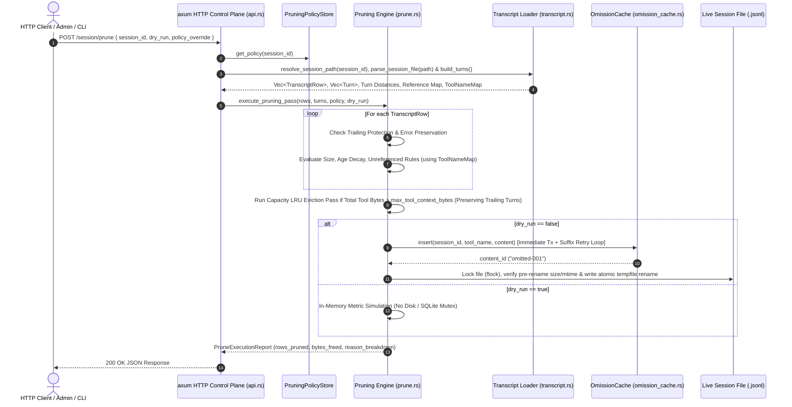

# Implementation Plan: `memory-pruning`

**Project**: `memory-pruning`  
**Target Architecture**: Turn-Based Multi-Criteria Transcript Memory Pruning Engine & HTTP Control Plane  
**Target Directory**: `/home/tstapler/.stapler-squad/repos/github.com/tstapler/consolette`  
**Date**: 2026-09-18  

---

## Executive Summary

The `memory-pruning` project upgrades consolette's transcript memory management from a single-row flat-character check (`src/claude_code_session/prune.rs`) into a multi-criteria, turn-aware memory pruning engine. It introduces:
1. **Configurable Policy Engine (`PruningPolicy`)**: Turn age decay (`max_turn_age`), unreferenced tool output eviction (`unreferenced_turn_decay`), tool name glob matching (`glob::Pattern`), transcript capacity bounds (`max_tool_context_bytes`), trailing turn protection (`preserve_recent_turns`), and error preservation.
2. **Turn Distance & Reference Tracking Engine**: Relative turn age calculation ($A = (N-1) - T$) and assistant citation tracking across turns.
3. **Multi-Criteria & Capacity LRU Pruning Passes**: Stream evaluation over `TranscriptRow` sequence with idempotent `OmissionCache` storage and backward-compatible placeholders (`[pruned: see read_omitted_content(...)]`).
4. **Thread-Safe File Locking & Atomic Rewrite Pipeline**: Exclusive file locking (`flock`), trailing incomplete line detection at EOF, and atomic tempfile replacement preventing live append races and data loss.
5. **RESTful HTTP API Control Plane**: `POST /session/prune`, `POST /session/policy`, and `GET /session/prune/stats` mounted under axum in `src/entrypoint/api.rs` supporting dry-run simulation mode (`dry_run: true`).

---

## System Architecture & Sequence Diagram

---

## Epics, Stories & Tasks Breakdown

### Epic 1: Policy Data Structures & Store (`PruningPolicy`, Glob Rules, `PruningPolicyStore`)

#### Story 1.1: Core `PruningPolicy` & `ToolPruningRule` Data Model
- **Task 1.1.1**: Define `PruningPolicy` and `ToolPruningRule` structs in `src/claude_code_session/prune.rs` (or `prune_policy.rs`) with `serde::{Serialize, Deserialize}`.
  - Fields: `enabled: bool`, `default_limit_chars: usize`, `default_limit_words: usize`, `max_turn_age: Option<usize>`, `unreferenced_turn_decay: Option<usize>`, `max_tool_context_bytes: Option<usize>`, `preserve_recent_turns: usize`, `preserve_error_outputs: bool`, `tool_rules: Vec<ToolPruningRule>`.
  - `ToolPruningRule` fields: `pattern: String`, `limit_chars: Option<usize>`, `max_turn_age: Option<usize>`, `unreferenced_turn_decay: Option<usize>`, `force_prune: bool`.
- **Task 1.1.2**: Implement `Default` trait for `PruningPolicy` and tool-name pattern matching using `glob::Pattern` (`glob = "0.3"`).
  - Include default rules for `"Bash"` (1024 chars, age 5), `"Agent"` (4096 chars, age 10), and `"TaskOutput"` (4096 chars, age 10).
- **Task 1.1.3**: Add unit tests in `src/claude_code_session/prune.rs` verifying serialization, default fallbacks, and glob pattern evaluation (`mcp__*`, `Bash*`, `Read`).

#### Story 1.2: Concurrent Policy Management Store (`PruningPolicyStore`)
- **Task 1.2.1**: Implement `PruningPolicyStore` struct using `std::sync::RwLock` for thread-safe access:
  - `global_policy: RwLock<PruningPolicy>`
  - `session_overrides: RwLock<HashMap<String, PruningPolicy>>`
- **Task 1.2.2**: Implement thread-safe methods: `get_policy(session_id: Option<&str>) -> PruningPolicy`, `set_session_policy(session_id: String, policy: PruningPolicy)`, `set_global_policy(policy: PruningPolicy)`, `clear_session_policy(session_id: &str)`.
- **Task 1.2.3**: Add unit tests for `PruningPolicyStore` validating concurrent reader/writer access and session override fallback to global policy.

---

### Epic 2: Transcript Analysis, Turn Distances, Reference Resolution & Tool Name Lookup

#### Story 2.1: Turn Sequence & Relative Age Reconstruction
- **Task 2.1.1**: Extend turn analysis in `src/claude_code_session/transcript.rs` to compute total active turns $N$ and relative turn age $A_i = (N - 1) - i$ for each turn $i \in [0 \dots N-1]$.
- **Task 2.1.2**: Implement trailing turn protection check: identify turns where turn index $i \ge N - \text{preserve\_recent\_turns}$ (default $M=2$) and mark all tool results in these turns as protected active turns.
- **Task 2.1.3**: Add unit tests in `transcript.rs` verifying turn age calculation, single-turn sessions, and trailing turn protection boundaries.
- **Task 2.1.4**: Assign turn indices to subagent sidechain rows (`is_sidechain == true`). Map sidechain `Agent` / `TaskOutput` tool result rows to the turn index of their parent main-chain assistant turn so turn age calculation $A_i = (N-1) - i$ and turn-age decay rules apply properly to sidechain tool results.

#### Story 2.2: Tool Output Reference Tracking Engine & Tool Name Lookup Mapping
- **Task 2.2.1**: Build `ReferenceMap` scanner in `src/claude_code_session/transcript.rs` / `prune.rs` that inspects assistant turns for `tool_use_id` citations, target file path matches, `read_omitted_content` placeholder references, and originating `tool_use` input parameters (e.g. `file_path`, `path`, `command`, `id`).
- **Task 2.2.2**: Implement reference resolution logic to determine if a `tool_result` in turn $T_{\text{tool}}$ was referenced by any subsequent assistant turn $T_{\text{asst}} > T_{\text{tool}}$, matching linked `tool_use` parameters (file paths, tool IDs) across assistant turns, and compute elapsed unreferenced turns to prevent false negative evictions of active context.
- **Task 2.2.3**: Add unit tests for `ReferenceMap` validating direct `tool_use_id` linkage, path references, and preventing false negative evictions.
- **Task 2.2.4**: Build `tool_use_id -> tool_name` lookup map (`ToolNameMap`) during transcript scanning (`transcript.rs`) by mapping `tool_use.id` to `tool_name` from assistant turns/blocks, and pass resolved tool names to `prune_tool_row_with_policy` so `tool_result` blocks (which lack explicit `tool_name` fields in Claude Code API) resolve their tool name for glob rule matching.

---

### Epic 3: Multi-Criteria Pruning Engine & Capacity Bounds

#### Story 3.1: Multi-Criteria Tool Row Evaluation
- **Task 3.1.1**: Upgrade `prune_tool_row` in `src/claude_code_session/prune.rs` to `prune_tool_row_with_policy` taking `&PruningPolicy`, turn age $A$, reference status `is_referenced`, error flag `is_error`, and resolved `tool_name` from `ToolNameMap`.
  - Check Rule 0: Skip if protected trailing turn or `is_error && preserve_error_outputs`.
  - Check Rule 1: Exceeds character/word threshold?
  - Check Rule 2: Exceeds `max_turn_age`?
  - Check Rule 3: Exceeds `unreferenced_turn_decay` and `!is_referenced`?
- **Task 3.1.2**: Implement Idempotency Guard: if `content` string already begins with `"[pruned: see read_omitted_content"`, return `PrunedRow::Unchanged` immediately to prevent nested placeholder corruption.
- **Task 3.1.3**: Update `OmissionCache` insertion and placeholder generation, maintaining exact format: `[pruned: see read_omitted_content(session_id, "{content_id}")]`.
- **Task 3.1.4**: Add unit tests in `prune.rs` verifying multi-criteria evaluation rules, error output preservation, and idempotency guard behavior.

#### Story 3.2: Cumulative Capacity & LRU Eviction Pass
- **Task 3.2.1**: Implement transcript capacity check: calculate total unpruned tool result bytes across the active transcript against `max_tool_context_bytes`.
- **Task 3.2.2**: Implement LRU/LRR eviction pass: when total tool bytes exceed `max_tool_context_bytes`, sort unpruned historical tool results by tuple `(is_referenced, last_reference_turn_index, turn_index)` ascending, and evict non-protected candidates into `OmissionCache` until total tool bytes $\le$ `max_tool_context_bytes`. Enforce trailing turn protection (`preserve_recent_turns`) precedence over capacity caps: stop eviction when only protected recent turns remain, and emit a `tracing::warn!` log message if protected recent turns alone exceed `max_tool_context_bytes`.
- **Task 3.2.3**: Add unit tests in `prune.rs` validating context budget enforcement while respecting trailing turn protection.

---

### Epic 4: Thread-Safe File-Locking & Atomic Rewrite Pipeline

#### Story 4.1: Exclusive File Locking & EOF Partial-Line Integrity
- **Task 4.1.1**: Implement exclusive file locking (`flock` / `fs2` / `tokio::fs`) on live transcript `.jsonl` files during pruning passes to prevent concurrent CLI append race conditions.
- **Task 4.1.2**: Enhance `parse_session_file` in `src/claude_code_session/transcript.rs` to detect incomplete lines at EOF (missing trailing newline or serde parse error on final line) and abort pruning cleanly rather than dropping unparsed active lines.
- **Task 4.1.3**: Add unit tests for file locking and incomplete EOF handling.

#### Story 4.2: Safe Atomic Transcript Rewriting & Schema Preservation
- **Task 4.2.1**: Implement row-by-row mapping pipeline over the complete `Vec<TranscriptRow>` preserving unlinked root rows, disconnected chains, and sidechain metadata without chain coverage data loss.
- **Task 4.2.2**: Implement atomic temporary file replacement (`tempfile` + atomic rename within the same project directory) preserving `sessionId` restamping rules during in-place pruning.
- **Task 4.2.3**: Add integration tests verifying transcript schema round-tripping, `sessionId` preservation, and session restoration (`--resume`) compatibility.
- **Task 4.2.4**: Implement pre-rename file size and mtime verification in the atomic rewrite pipeline (`transcript.rs` / `prune.rs`). Immediately before performing atomic tempfile replacement over the target session file, check that on-disk file size and modification timestamp match the initial read snapshot, aborting the atomic swap and returning an error/retrying if the file was modified by concurrent Claude Code CLI appends while `flock` was held.

#### Story 4.3: `OmissionCache` SQLite Multi-Process Concurrency
- **Task 4.3.1**: Update `OmissionCache::insert` in `src/claude_code_session/omission_cache.rs` to use `TransactionBehavior::Immediate` write locks and implement a monotonic suffix retry loop (`omitted-001_1`, `omitted-001_2`, ...) upon primary key `(session_id, content_id)` collision, eliminating primary key collisions across concurrent process handles in compliance with `ADR-002`.
- **Task 4.3.2**: Add concurrent multi-thread and multi-process unit tests for `OmissionCache::insert`.

---

### Epic 5: RESTful HTTP API Control Plane & Axum Integration

#### Story 5.1: HTTP Endpoints & Dry-Run Engine (`POST /session/prune`, `POST /session/policy`, `GET /session/prune/stats`)
- **Task 5.1.0**: Implement transcript file discovery service (`resolve_session_path`) in `src/claude_code_session/transcript.rs` or `api.rs`, resolving incoming `session_id` UUIDs to `~/.claude/projects/*/<session_id>.jsonl` on disk with path traversal validation and project folder globbing before invoking `parse_session_file`.
- **Task 5.1.1**: Define request and response DTO structs in `src/entrypoint/api.rs`: `PruneRequest`, `PruneResponse`, `PolicyRequest`, `PolicyResponse`, `SessionPruningStats`, `PruneReasonBreakdown`.
- **Task 5.1.2**: Implement `POST /session/prune` handler supporting dry-run simulation mode (`dry_run: true`) which calculates pruned rows, bytes freed, and reason breakdown in-memory without mutating on-disk transcripts or `OmissionCache`.
- **Task 5.1.3**: Implement `POST /session/policy` handler for querying and updating global or per-session policies in `PruningPolicyStore`.
- **Task 5.1.4**: Implement `GET /session/prune/stats` handler returning total turns, total rows, pruned row count, omission cache entries, and active policy parameters.
- **Task 5.1.5**: Implement strict UUID v4 parsing (`uuid::Uuid::parse_str`) on `session_id` input parameters across all endpoints to prevent path traversal security vulnerabilities.

#### Story 5.2: Axum Entrypoint Wiring & State Integration
- **Task 5.2.1**: Update `EntrypointState` in `src/entrypoint/mod.rs` to include `pruning_policy_store: Arc<PruningPolicyStore>` and `omission_cache: Arc<OmissionCache>`.
- **Task 5.2.2**: Mount routes `/session/prune`, `/session/policy`, and `/session/prune/stats` under `entrypoint_router` in `src/entrypoint/mod.rs`.
- **Task 5.2.3**: Add HTTP integration tests in `src/entrypoint/api.rs` / `mod.rs` verifying endpoint responses, dry-run evaluation, policy updates, and error handling using axum `oneshot` requests.

---

## Critical Metrics & Key Architectural Choices

| Metric / Choice | Value / Strategy | Rationale |
| :--- | :--- | :--- |
| **Epic Count** | **5 Epics** | Core domains: Policy Data, Turn/Reference Analysis, Multi-Criteria Engine, File/Locking Pipeline, HTTP Control Plane. |
| **Story Count** | **11 Stories** | Focused, testable units of work. |
| **Task Count** | **31 Tasks** | Granular, self-contained implementation tasks resolving all adversarial review findings. |
| **Row-Mapping Architecture** | Line-by-line mapping over `Vec<TranscriptRow>` | Prevents data loss for disconnected transcript chains (`chain_coverage < 1.0`) and sidechain rows. |
| **Trailing Turn Protection** | $M = 2$ active turns protected | Prevents turn decay or eviction from pruning active tool results needed by the immediate agent tool loop; takes precedence over capacity caps with `tracing::warn!`. |
| **Immediate SQLite Tx & Retry Loop** | `TransactionBehavior::Immediate` + `omitted-001_1` fallback | Eliminates `(session_id, content_id)` primary key collisions across concurrent process handles (`ADR-002`). |
| **Idempotency Guard** | Prefix check on `"[pruned: see ..."` | Prevents re-pruning already pruned rows and generating nested placeholders. |
| **Dry-Run Engine** | Pure in-memory metric calculation | Prevents sequence counter pollution in SQLite and transcript corruption during preview requests. |
| **Security & Discovery** | Local-only bind, UUID v4 check + `resolve_session_path` | Guarantees loopback isolation, resolves session UUIDs to `~/.claude/projects/*/<session_id>.jsonl`, and eliminates path traversal security vectors. |

---

## Verification Plan

1. **Unit Verification**:
   - `cargo test claude_code_session::prune` (Policy rules, turn age decay, unreferenced eviction, capacity LRU, idempotency guard).
   - `cargo test claude_code_session::transcript` (Turn reconstruction, relative turn distances, reference map).
   - `cargo test claude_code_session::omission_cache` (Immediate transactions, concurrent insertions).
2. **Integration Verification**:
   - `cargo test entrypoint::api` (`POST /session/prune`, `POST /session/policy`, `GET /session/prune/stats`, dry-run mode).
   - End-to-end transcript restoration verification (`--resume` compatibility on pruned transcript files).
3. **Quality Gates**:
   - `cargo clippy --all-targets -- -D warnings` (Zero warnings, strictly enforcing pedantic lints without unhandled `.unwrap()`).
   - `cargo fmt --check` (Formatting compliance).
