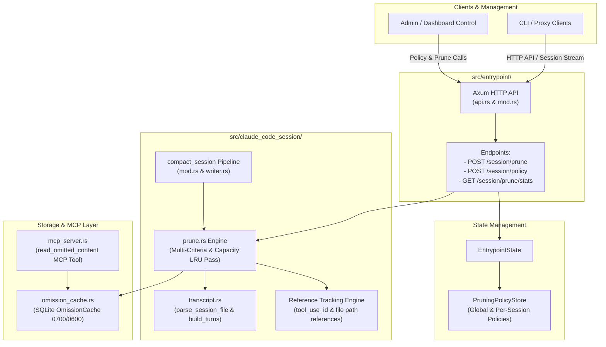

# Architecture Research: Turn-Based Memory Pruning Engine & HTTP Control Plane

**Project**: `memory-pruning`  
**Repository**: `/home/tstapler/.stapler-squad/repos/github.com/tstapler/consolette`  
**Date**: 2026-09-18  
**Status**: Architecture Design Document  

---

## 1. Executive Summary & Architectural Overview

As long-running LLM agent session transcripts (such as Claude Code sessions) progress over dozens or hundreds of turns, tool execution outputs (`Bash` stdout/stderr, `Read` file contents, `Grep` matches, subagent outputs) rapidly inflate context window usage. Unchecked accumulation increases context token usage, per-turn prefill latency, and API costs, while degrading model performance through context distraction.

Consolette currently features a single-row binary threshold check ([src/claude_code_session/prune.rs](file:///home/tstapler/.stapler-squad/repos/github.com/tstapler/consolette/src/claude_code_session/prune.rs)) and an SQLite-backed content cache ([src/claude_code_session/omission_cache.rs](file:///home/tstapler/.stapler-squad/repos/github.com/tstapler/consolette/src/claude_code_session/omission_cache.rs)). However, the existing implementation is **turn-blind**, **reference-blind**, **capacity-blind**, and **unconfigurable at runtime**.

This architecture document defines the design for upgrading `consolette`'s memory pruning system into a multi-criteria, turn-aware memory management engine. The target architecture introduces:
1. **Turn-Aware & Reference-Aware Pruning Engine**: Evaluates turn age decay, unreferenced tool output eviction, pattern-based tool matching, and total transcript tool context capacity bounds (LRU/LRR).
2. **Runtime Policy Store**: Concurrent, thread-safe policy configuration (`PruningPolicyStore`) with global defaults and per-session policy overrides.
3. **HTTP Control Plane Endpoints**: RESTful endpoints (`POST /session/prune`, `POST /session/policy`, `GET /session/prune/stats`) integrated directly into `consolette`'s `axum` entrypoint ([src/entrypoint/api.rs](file:///home/tstapler/.stapler-squad/repos/github.com/tstapler/consolette/src/entrypoint/api.rs)).
4. **Seamless Integration**: Cohesive integration with `TranscriptRow`, `OmissionCache`, `build_turns`, `compact_session`, and `read_omitted_content` MCP server tools ([src/claude_code_session/mcp_server.rs](file:///home/tstapler/.stapler-squad/repos/github.com/tstapler/consolette/src/claude_code_session/mcp_server.rs)).

---

## 2. System Architecture & Component Interaction



### Key Subsystem Responsibilities

1. **HTTP Entrypoint (`src/entrypoint/api.rs`, `src/entrypoint/mod.rs`)**:
   - Mounts the `/session/*` route hierarchy under `axum::Router`.
   - Delegates requests to the pruning policy store and pruning engine.
   - Supports both active execution and dry-run policy evaluation.

2. **Policy Configuration Store (`src/claude_code_session/prune_policy.rs` or `prune.rs`)**:
   - Manages process-wide default `PruningPolicy` and per-session policy overrides (`Arc<PruningPolicyStore>`).
   - Supports dynamic updating without requiring server restart.

3. **Transcript & Reference Analysis (`src/claude_code_session/transcript.rs`)**:
   - Parses session JSONL files into `TranscriptRow` vectors.
   - Reconstructs active turn chains (`Vec<Turn>`) and computes turn distances (`turn_age`).
   - Scans assistant turns to build `ReferenceMap` identifying referenced `tool_use_id`s and output tokens.

4. **Multi-Criteria Pruning Engine (`src/claude_code_session/prune.rs`)**:
   - Implements evaluation logic for flat size limits, turn-age decay, unreferenced eviction, and capacity/LRU bounds.
   - Preserves error outputs when configured, and exempts recent trailing turns (`preserve_recent_turns`).
   - Writes pruned raw content into `OmissionCache` and replaces row content with `[pruned: see read_omitted_content(...)]` placeholders.

5. **Omission Cache & MCP Server (`src/claude_code_session/omission_cache.rs`, `mcp_server.rs`)**:
   - Stores raw uncompressed tool outputs keyed by `(session_id, content_id)`.
   - Exposes `read_omitted_content` over MCP stdio to allow Claude Code to retrieve pruned content on demand.

---

## 3. Data Structures & Domain Models

### 3.1 `PruningPolicy` & Tool Matching Rules

```rust
use serde::{Deserialize, Serialize};

/// Comprehensive multi-criteria pruning policy.
#[derive(Debug, Clone, PartialEq, Serialize, Deserialize)]
pub struct PruningPolicy {
    /// Master toggle for turn-based pruning.
    pub enabled: bool,
    /// Default flat character threshold (fallback when no pattern matches).
    pub default_limit_chars: usize,
    /// Default flat word threshold (fallback).
    pub default_limit_words: usize,
    /// Maximum turn age before a tool output is unconditionally pruned (e.g., 8 turns).
    pub max_turn_age: Option<usize>,
    /// Turns without an assistant reference before unreferenced output is evicted (e.g., 3 turns).
    pub unreferenced_turn_decay: Option<usize>,
    /// Maximum cumulative bytes allocated to historical unpruned tool outputs in transcript.
    pub max_tool_context_bytes: Option<usize>,
    /// Number of trailing recent turns strictly protected from age/decay pruning (default: 2).
    pub preserve_recent_turns: usize,
    /// Preserve tool execution results where is_error == true.
    pub preserve_error_outputs: bool,
    /// Tool-name specific glob rules and overrides.
    pub tool_rules: Vec<ToolPruningRule>,
}

impl Default for PruningPolicy {
    fn default() -> Self {
        Self {
            enabled: true,
            default_limit_chars: 1024,
            default_limit_words: 128,
            max_turn_age: Some(8),
            unreferenced_turn_decay: Some(4),
            max_tool_context_bytes: Some(100_000), // ~25k tokens
            preserve_recent_turns: 2,
            preserve_error_outputs: true,
            tool_rules: vec![
                ToolPruningRule {
                    pattern: "Bash".to_string(),
                    limit_chars: Some(1024),
                    max_turn_age: Some(5),
                    unreferenced_turn_decay: Some(2),
                    force_prune: false,
                },
                ToolPruningRule {
                    pattern: "Agent".to_string(),
                    limit_chars: Some(4096),
                    max_turn_age: Some(10),
                    unreferenced_turn_decay: Some(5),
                    force_prune: false,
                },
                ToolPruningRule {
                    pattern: "TaskOutput".to_string(),
                    limit_chars: Some(4096),
                    max_turn_age: Some(10),
                    unreferenced_turn_decay: Some(5),
                    force_prune: false,
                },
            ],
        }
    }
}

/// Tool-specific matching rule supporting glob patterns.
#[derive(Debug, Clone, PartialEq, Serialize, Deserialize)]
pub struct ToolPruningRule {
    /// Glob pattern matching tool name (e.g., "Bash", "Read", "mcp__*").
    pub pattern: String,
    /// Character threshold override for this tool class.
    pub limit_chars: Option<usize>,
    /// Maximum turn age override for this tool class.
    pub max_turn_age: Option<usize>,
    /// Unreferenced turn decay override for this tool class.
    pub unreferenced_turn_decay: Option<usize>,
    /// Force pruning regardless of size once age threshold is met.
    pub force_prune: bool,
}
```

### 3.2 Thread-Safe `PruningPolicyStore`

```rust
use std::collections::HashMap;
use std::sync::RwLock;

/// Concurrent in-memory store for global and per-session pruning policies.
pub struct PruningPolicyStore {
    global_policy: RwLock<PruningPolicy>,
    session_overrides: RwLock<HashMap<String, PruningPolicy>>,
}

impl PruningPolicyStore {
    pub fn new(default_policy: PruningPolicy) -> Self {
        Self {
            global_policy: RwLock::new(default_policy),
            session_overrides: RwLock::new(HashMap::new()),
        }
    }

    /// Retrieve effective policy for a given session (or global fallback).
    pub fn get_policy(&self, session_id: Option<&str>) -> PruningPolicy {
        if let Some(id) = session_id {
            if let Ok(guard) = self.session_overrides.read() {
                if let Some(policy) = guard.get(id) {
                    return policy.clone();
                }
            }
        }
        self.global_policy.read().unwrap().clone()
    }

    /// Set session policy override.
    pub fn set_session_policy(&self, session_id: String, policy: PruningPolicy) {
        if let Ok(mut guard) = self.session_overrides.write() {
            guard.insert(session_id, policy);
        }
    }

    /// Update global default policy.
    pub fn set_global_policy(&self, policy: PruningPolicy) {
        if let Ok(mut guard) = self.global_policy.write() {
            *guard = policy;
        }
    }

    /// Clear session policy override.
    pub fn clear_session_policy(&self, session_id: &str) {
        if let Ok(mut guard) = self.session_overrides.write() {
            guard.remove(session_id);
        }
    }
}
```

### 3.3 Execution Metrics & Report Data Structures

```rust
use serde::{Deserialize, Serialize};

/// Detailed report of a pruning execution pass.
#[derive(Debug, Clone, PartialEq, Serialize, Deserialize)]
pub struct PruneExecutionReport {
    pub session_id: String,
    pub rows_evaluated: usize,
    pub rows_pruned: usize,
    pub bytes_freed: usize,
    pub estimated_tokens_saved: usize,
    pub pruned_by_reason: PruneReasonBreakdown,
    pub dry_run: bool,
}

#[derive(Debug, Clone, Default, PartialEq, Serialize, Deserialize)]
pub struct PruneReasonBreakdown {
    pub size_threshold: usize,
    pub turn_age: usize,
    pub unreferenced_decay: usize,
    pub capacity_lru: usize,
}

/// Session transcript pruning statistics for GET /session/prune/stats.
#[derive(Debug, Clone, PartialEq, Serialize, Deserialize)]
pub struct SessionPruningStats {
    pub session_id: String,
    pub total_turns: usize,
    pub total_rows: usize,
    pub pruned_rows_count: usize,
    pub omission_cache_entries: usize,
    pub current_tool_output_bytes: usize,
    pub historical_bytes_pruned: usize,
    pub active_policy: PruningPolicy,
}
```

---

## 4. Turn Reconstruction, Reference Tracking, & Multi-Criteria Engine Algorithm

### 4.1 Turn Reconstruction & Turn Distance

Given a sequence of `TranscriptRow` items parsed via `parse_session_file`:
1. Execute `build_turns(&rows)` ([src/claude_code_session/transcript.rs](file:///home/tstapler/.stapler-squad/repos/github.com/tstapler/consolette/src/claude_code_session/transcript.rs#L248)) to group rows into logical `Turn` structures.
2. Let $N$ be the total number of turns (`turns.len()`).
3. For each turn $T_i$ ($0 \le i < N$), calculate its **turn age**:
   $$\text{turn\_age}(i) = (N - 1) - i$$
   * Turn $N-1$ (latest active turn) has `turn_age = 0`.
   * Turn $N-2$ has `turn_age = 1`, and so forth.
4. **Trailing Turn Protection**: Turns where $i \ge N - \text{preserve\_recent\_turns}$ are marked as **protected active turns**. Age decay and unreferenced eviction will not touch tool results in protected turns.

### 4.2 Reference Tracking Analysis

To identify whether a tool result has been referenced:
1. Scan all assistant rows across turns $i = 0 \dots N-1$.
2. Extract all `tool_use_id` references present in assistant `tool_use` blocks or message text.
3. Maintain a `HashSet<String>` of referenced `tool_use_id` values across the transcript.
4. A `tool_result` block carrying `tool_use_id = X` is considered **referenced** if $X \in \text{referenced\_set}$ or if subsequent assistant turns cite its output content.

### 4.3 Multi-Criteria Evaluation Pipeline

```
                     +----------------------------------+
                     | Tool Result Candidate in Turn T  |
                     +----------------------------------+
                                      |
                                      v
                      /--------------------------------\
                     /  Is Turn T in Protected Recent   \   YES
                    <   Window? (i >= N - preserve)      >-------> [ KEEP VERBATIM ]
                     \                                  /
                      \--------------------------------/
                                      | NO
                                      v
                      /--------------------------------\
                     /  Is is_error == true AND         \   YES
                    <   preserve_error_outputs == true?  >-------> [ KEEP VERBATIM ]
                     \                                  /
                      \--------------------------------/
                                      | NO
                                      v
                      /--------------------------------\
                     /   Rule 1: Exceeds Size Limit?    \   YES
                    <   (char_len > limit_chars OR       >-------> [ MARK PRUNED: SIZE ]
                     \   word_count > limit_words)      /
                      \--------------------------------/
                                      | NO
                                      v
                      /--------------------------------\
                     /   Rule 2: Exceeds Max Turn Age?  \   YES
                    <   (turn_age > max_turn_age)        >-------> [ MARK PRUNED: AGE ]
                     \                                  /
                      \--------------------------------/
                                      | NO
                                      v
                      /--------------------------------\
                     /   Rule 3: Unreferenced Decay?    \   YES
                    <   (turn_age > decay_turns AND      >-------> [ MARK PRUNED: DECAY ]
                     \   !is_referenced)                /
                      \--------------------------------/
                                      | NO
                                      v
                            [ KEEP IN CANDIDATE POOL ]
                                      |
                                      v
                      +--------------------------------+
                      | Capacity / LRU Enforcement Pass|
                      +--------------------------------+
```

### 4.4 Capacity & LRU Eviction Pass

After multi-criteria filtering, candidate tool results remaining inline are evaluated for cumulative byte capacity:
1. Compute $\text{TotalToolBytes} = \sum \text{len}(\text{tool\_result\_text})$.
2. If `max_tool_context_bytes` is configured and $\text{TotalToolBytes} > \text{max\_tool\_context\_bytes}$:
   - Sort unpruned tool results by tuple `(is_referenced, last_reference_turn_index, turn_index)` ascending. Unreferenced tool results from older turns sort first.
   - Iterate through sorted items and prune them sequentially into `OmissionCache`, incrementing `pruned_by_reason.capacity_lru`, until $\text{TotalToolBytes} \le \text{max\_tool\_context\_bytes}$.

---

## 5. HTTP API Endpoint Specification

All endpoints are mounted under `/session` on consolette's primary axum HTTP entrypoint ([src/entrypoint/api.rs](file:///home/tstapler/.stapler-squad/repos/github.com/tstapler/consolette/src/entrypoint/api.rs) & [src/entrypoint/mod.rs](file:///home/tstapler/.stapler-squad/repos/github.com/tstapler/consolette/src/entrypoint/mod.rs)).

### 5.1 `POST /session/prune`

Triggers a manual or automated pruning pass over a target session transcript.

* **Method**: `POST`
* **Path**: `/session/prune`
* **Content-Type**: `application/json`
* **Request Schema**:
```json
{
  "session_id": "string (required)",
  "dry_run": "boolean (optional, default: false)",
  "policy_override": "PruningPolicy (optional)"
}
```
* **Response (200 OK)**:
```json
{
  "session_id": "94bd08fd-a105-4b01-b25d-160489a204e2",
  "rows_evaluated": 184,
  "rows_pruned": 22,
  "bytes_freed": 145200,
  "estimated_tokens_saved": 36300,
  "pruned_by_reason": {
    "size_threshold": 8,
    "turn_age": 9,
    "unreferenced_decay": 3,
    "capacity_lru": 2
  },
  "dry_run": false
}
```
* **Status Codes**:
  - `200 OK`: Pruning pass completed successfully.
  - `400 Bad Request`: Invalid session ID or unparseable policy override.
  - `404 Not Found`: Session transcript file does not exist.
  - `500 Internal Server Error`: Pruning evaluation or SQLite insertion failure.

### 5.2 `POST /session/policy`

Queries or updates the active global default policy or a specific session policy override.

* **Method**: `POST`
* **Path**: `/session/policy`
* **Content-Type**: `application/json`
* **Request Schema**:
```json
{
  "session_id": "string (optional - null or omitted updates global default)",
  "policy": {
    "enabled": true,
    "default_limit_chars": 1024,
    "default_limit_words": 128,
    "max_turn_age": 8,
    "unreferenced_turn_decay": 4,
    "max_tool_context_bytes": 100000,
    "preserve_recent_turns": 2,
    "preserve_error_outputs": true,
    "tool_rules": [
      {
        "pattern": "Bash",
        "limit_chars": 1024,
        "max_turn_age": 5,
        "unreferenced_turn_decay": 2,
        "force_prune": false
      }
    ]
  }
}
```
* **Response (200 OK)**:
```json
{
  "status": "updated",
  "scope": "session",
  "session_id": "94bd08fd-a105-4b01-b25d-160489a204e2"
}
```

### 5.3 `GET /session/prune/stats`

Retrieves current memory pruning statistics and omission cache status for a session.

* **Method**: `GET`
* **Path**: `/session/prune/stats?session_id=<uuid>`
* **Response (200 OK)**:
```json
{
  "session_id": "94bd08fd-a105-4b01-b25d-160489a204e2",
  "total_turns": 28,
  "total_rows": 210,
  "pruned_rows_count": 35,
  "omission_cache_entries": 35,
  "current_tool_output_bytes": 42100,
  "historical_bytes_pruned": 512000,
  "active_policy": {
    "enabled": true,
    "max_turn_age": 8,
    "unreferenced_turn_decay": 4,
    "max_tool_context_bytes": 100000
  }
}
```

---

## 6. Integration Touchpoints & Architectural Alignment

### 6.1 Integration with `EntrypointState` ([src/entrypoint/mod.rs](file:///home/tstapler/.stapler-squad/repos/github.com/tstapler/consolette/src/entrypoint/mod.rs))

`EntrypointState` will hold thread-safe references to the pruning policy store and omission cache:

```rust
#[derive(Clone)]
pub struct EntrypointState {
    pub dispatch_router: Arc<ArcSwap<DispatchRouter>>,
    pub cost_tracker: Arc<CostTracker>,
    pub metrics: Arc<MetricsCollector>,
    pub server_info: Arc<ServerInfo>,
    pub config_dir: Arc<std::path::PathBuf>,
    pub session_overrides: Arc<SessionOverrideStore>,
    pub capability: Arc<CapabilityCache>,
    pub server_tools: Arc<ServerToolsRuntime>,
    pub search_pool: Arc<McpSearchPool>,
    // -- Memory Pruning Extensions --
    pub pruning_policy_store: Arc<PruningPolicyStore>,
    pub omission_cache: Arc<OmissionCache>,
}
```

### 6.2 Router Wiring in `entrypoint_router` ([src/entrypoint/mod.rs](file:///home/tstapler/.stapler-squad/repos/github.com/tstapler/consolette/src/entrypoint/mod.rs#L173))

```rust
pub fn entrypoint_router(state: EntrypointState) -> axum::Router {
    axum::Router::new()
        // ... existing routes ...
        .route("/session/prune", axum::routing::post(api::post_session_prune))
        .route("/session/policy", axum::routing::post(api::post_session_policy))
        .route("/session/prune/stats", axum::routing::get(api::get_session_prune_stats))
        .layer(tower_http::trace::TraceLayer::new_for_http())
        .with_state(state)
}
```

### 6.3 Integration with `compact_session` ([src/claude_code_session/mod.rs](file:///home/tstapler/.stapler-squad/repos/github.com/tstapler/consolette/src/claude_code_session/mod.rs#L165))

The existing `compact_session` pipeline invokes `prune_turn` across prefix, summarize, and preserved turn sets. Upgrading `prune_turn` to accept `&PruningPolicy` ensures that turn compaction automatically enforces turn-decay, reference tracking, and capacity LRU limits during compaction passes.

### 6.4 MCP Tool Compatibility ([src/claude_code_session/mcp_server.rs](file:///home/tstapler/.stapler-squad/repos/github.com/tstapler/consolette/src/claude_code_session/mcp_server.rs))

Because pruned rows continue to output standard `[pruned: see read_omitted_content(session_id, "content_id")]` placeholders and insert raw bytes into `OmissionCache`, the existing `CompactionMcpServer` and `read_omitted_content` tool operate with **100% backward compatibility** and zero required schema changes.

---

## 7. Performance SLOs, Reliability, & Security Guardrails

### 7.1 Performance SLO Target
* **Execution Latency**: Pruning evaluation over transcripts up to 5,000 rows must complete in **< 10ms**.
* **Zero Alloc Stream Parse**: Line streaming via `BufReader` ensures memory consumption remains $O(\text{turn\_count})$ rather than $O(\text{raw\_transcript\_bytes})$.

### 7.2 Safety & Structural Integrity
* **Schema Round-tripping**: Re-serializing pruned rows preserves `uuid`, `parentUuid`, `isSidechain`, `isMeta`, and all `extra` JSON fields verbatim.
* **Atomic Writes**: Written transcript updates use atomic temporary file creation (`tempfile`) and atomic rename to ensure zero corruption during concurrent reader access.
* **Dry-Run Mode**: `POST /session/prune` with `dry_run: true` calculates all metrics without mutating on-disk transcripts or inserting into SQLite.

### 7.3 Data Security & Permissions
* **Cache Security**: `OmissionCache::open` enforces `0700` permissions on the directory and `0600` on the SQLite database file ([src/claude_code_session/omission_cache.rs](file:///home/tstapler/.stapler-squad/repos/github.com/tstapler/consolette/src/claude_code_session/omission_cache.rs#L46-L50)), preventing unauthorized local access to cached unredacted tool output.
* **Session Scoping**: All cache lookups are strictly scoped by `(session_id, content_id)` composite primary key, guarding against cross-session content leaks.

---

## 8. Summary of Architectural Recommendations

1. **Implement `PruningPolicy` & `PruningPolicyStore`**: Create a flexible, serializable policy engine with thread-safe global defaults and per-session overrides.
2. **Extend Engine with Multi-Criteria & Capacity Rules**: Enhance `src/claude_code_session/prune.rs` to compute turn age distances, reference maps, unreferenced decay, and capacity LRU bounds.
3. **Expose HTTP Control Plane**: Add `/session/prune`, `/session/policy`, and `/session/prune/stats` endpoints to `src/entrypoint/api.rs` for dynamic control, policy updates, and metrics reporting.
