# Architecture & System Design: WebUI Redesign

**Date**: 2026-09-27  
**Feature**: WebUI Redesign (`webui-redesign`)  
**Status**: Research & Design Phase  
**Target File**: `project_plans/webui-redesign/research/architecture.md`  

---

## Executive Summary

The `webui-redesign` replaces the single-file inline static HTML/JS dashboard ([dashboard.rs](file:///home/tstapler/.stapler-squad/repos/github.com/tstapler/consolette/src/dashboard.rs)) in `consolette` with an embedded, full-featured multi-page Angular Single-Page Application (SPA). The new WebUI provides real-time telemetry streaming via Server-Sent Events (SSE), interactive session replay with payload diff viewing, live model benchmarking across upstreams, and dynamic proxy configuration management—all bundled directly into the single Rust executable with zero runtime Node.js or external CDN dependencies.

---

## 1. High-Level Integration Architecture

The architecture connects Axum 0.8 HTTP handlers, a `tokio::sync::broadcast` event channel, and Angular Signal-based frontend state stores.

```mermaid
flowchart TD
    subgraph Client ["Angular SPA (Browser)"]
        UI["Angular Component Views\n(Overview / Replay / Benchmarks / Config)"]
        SignalStore["Angular Signal Stores\n(MetricsStore, SessionStore, BenchmarkStore, ConfigStore)"]
        SSEService["RxJS SseService\n(EventSource Connection)"]
        HTTPClient["Angular HttpClient\n(REST API Services)"]
        
        UI --> SignalStore
        SignalStore <-- SSEService
        SignalStore <-- HTTPClient
    end

    subgraph RustBackend ["Consolette Rust Binary (Axum 0.8)"]
        Router["Axum Router (entrypoint_router)"]
        
        subgraph Endpoints ["API & Asset Handlers"]
            StaticAssets["/dashboard/* & /assets/*\n(rust-embed Static Asset Server)"]
            SSEEndpoint["GET /v1/dashboard/events\n(Axum SSE Handler)"]
            SessionAPI["REST: /v1/dashboard/sessions & /requests/{id}\n(Session Replay & Payload Diff)"]
            BenchAPI["REST: /v1/dashboard/benchmark\n(Model Benchmarking Telemetry)"]
            ConfigAPI["REST: GET/PUT /v1/dashboard/config\n(Route & Upstream Hot-Swap)"]
        end

        subgraph Bus ["Event Broadcasting & State"]
            TxChannel["tokio::sync::broadcast::Sender<DashboardEvent>\n(Capacity: 1024)"]
            MetricsCol["MetricsCollector & ProxyMetrics"]
            StateHolder["EntrypointState & ArcSwap<DispatchRouter>"]
        end
    end

    SSEService <== "SSE Stream (EventSource)" ==> SSEEndpoint
    HTTPClient <== "JSON HTTP" ==> SessionAPI
    HTTPClient <== "JSON HTTP" ==> BenchAPI
    HTTPClient <== "JSON HTTP" ==> ConfigAPI
    UI <== "HTML/JS/CSS Assets" ==> StaticAssets

    SSEEndpoint <-- "Subscribe (rx.resubscribe())" --- TxChannel
    Router --> StaticAssets
    Router --> SSEEndpoint
    Router --> SessionAPI
    Router --> BenchAPI
    Router --> ConfigAPI

    MetricsCol -->|"Publish Trace / Error Events"| TxChannel
    StateHolder --> ConfigAPI
```

---

## 2. Component Specifications

### Section 1: Axum 0.8 Routing & Static Asset Server Endpoint (`/dashboard/*`)

#### Asset Embedding Mechanism
- **Crate**: `rust-embed` (or `include_dir`). Assets compiled into the binary at `frontend/dist/browser/`.
- **Struct Definition**:
  ```rust
  #[derive(rust_embed::RustEmbed)]
  #[folder = "frontend/dist/browser/"]
  pub struct DashboardAssets;
  ```

#### Router & Endpoint Mapping
Axum 0.8 matches nested routes and wildcard paths cleanly. The asset server registers:
1. `GET /dashboard/*path`: Serves embedded static files (`/dashboard/main.js`, `/dashboard/styles.css`, etc.). If the requested path is not found on disk (e.g. `/dashboard/sessions` or `/dashboard/benchmarks`), it falls back to serving `index.html` to support HTML5 client-side Angular Router navigation (`pushState`).
2. `GET /assets/*path`: Static asset directory (fonts, icons, bundled logos).

#### Response & Header Policy
- **Content-Type**: Inferred via `mime_guess::from_path(path)`.
- **Caching**:
  - `index.html`: `Cache-Control: no-cache, no-store, must-revalidate`
  - Hashed assets (`main.[hash].js`, `styles.[hash].css`): `Cache-Control: public, max-age=31536000, immutable`
- **Security Headers**: `X-Frame-Options: DENY`, `X-Content-Type-Options: nosniff`, `Content-Security-Policy: default-src 'self'; script-src 'self' 'unsafe-inline'; style-src 'self' 'unsafe-inline'`.

---

### Section 2: Axum SSE / WebSocket Broadcasting Server (`/v1/dashboard/events`)

#### Telemetry Transport Rationale
- **Selection**: **Server-Sent Events (SSE)** via `axum::response::sse::{Sse, Event}` over WebSockets.
- **Justification**: The dashboard telemetry flow is 100% unidirectional (server to browser). SSE is lighter, operates natively over standard HTTP/1.1 and HTTP/2, automatically handles browser reconnection via `EventSource`, requires no WebSocket upgrade handshakes, and integrates directly with RxJS.

#### Event Schema & Serialization
Events are defined as a strongly-typed Rust `enum` serialized to JSON:

```rust
#[derive(Debug, Clone, serde::Serialize)]
#[serde(tag = "type", content = "data")]
pub enum DashboardEvent {
    /// Periodic snapshot (1s interval) containing real-time RPM, lag, token counters, provider health
    MetricsTick(MetricsTickData),
    /// Emitted immediately upon completion of any HTTP request dispatch
    RequestTrace(RequestTraceData),
    /// Emitted when a provider error, rate limit, auth failure, or schema drift is recorded
    ErrorLogged(ErrorLoggedData),
    /// Emitted when the global route or a session override pin is updated
    ConfigChanged(ConfigChangedData),
}

#[derive(Debug, Clone, serde::Serialize)]
pub struct MetricsTickData {
    pub timestamp: String,
    pub total_requests: u64,
    pub success_rate: f64,
    pub error_rate: f64,
    pub current_lag_ms: f64,
    pub tokens_saved_total: u64,
    pub avg_compression_ratio: f64,
    pub active_providers: std::collections::HashMap<String, ProviderHealthStatus>,
}

#[derive(Debug, Clone, serde::Serialize)]
pub struct RequestTraceData {
    pub request_id: String,
    pub timestamp: String,
    pub session_id: Option<String>,
    pub provider: String,
    pub model: String,
    pub duration_ms: f64,
    pub first_byte_ms: f64,
    pub tokens_before: u64,
    pub tokens_after: u64,
    pub compressed: bool,
    pub stream: bool,
}
```

#### Broadcasting Pipeline
- **Channel**: `tokio::sync::broadcast::channel::<DashboardEvent>(1024)` stored in `EntrypointState`.
- **Lagging Receiver Handling**: If a slow browser client falls behind and receives `RecvError::Lagged(skipped_count)`, the SSE handler catches the error, emits a synthetic `Lagged` SSE comment event, and resumes streaming without closing the connection.
- **Heartbeat / Keep-Alive**: Configured via `Sse::new(stream).keep_alive(axum::response::sse::KeepAlive::new().interval(Duration::from_secs(15)).text("ping"))`.

---

### Section 3: REST / JSON API Endpoints

#### 1. Session Replay API
- `GET /v1/dashboard/sessions`
  - **Query Params**: `limit: Option<usize>`, `cursor: Option<String>`, `search: Option<String>`
  - **Response**: List of sessions recorded in the 100-request ring buffer or transcript storage, annotated with token savings, total turns, last active time, and session pin status (extending [api.rs](file:///home/tstapler/.stapler-squad/repos/github.com/tstapler/consolette/src/entrypoint/api.rs#L190)).
- `GET /requests/{id}?stage=original|compressed`
  - **Response**: Returns the exact JSON request payload.
  - **Upgrade**: Updates existing `get_request_body` in [observability.rs](file:///home/tstapler/.stapler-squad/repos/github.com/tstapler/consolette/src/entrypoint/observability.rs#L54) to fetch `compressed` payload snapshots from `OmissionCache` / compression engine rather than returning `404 NOT_FOUND`.

#### 2. Model Benchmarking API
- `GET /v1/dashboard/benchmark`
  - **Response**: Upstream-by-upstream and model-by-model comparative metrics:
    - Average TTFT (Time To First Byte) and duration percentiles ($p_{50}, p_{95}, p_{99}$).
    - Error rates & rate-limit frequency.
    - Static aider-polyglot benchmark scores cross-referenced from `bench_score()` ([bench_table.rs](file:///home/tstapler/.stapler-squad/repos/github.com/tstapler/consolette/src/routing/bench_table.rs)).
    - Composite scores from `OpenrouterScoringStrategy` ([model_stats.rs](file:///home/tstapler/.stapler-squad/repos/github.com/tstapler/consolette/src/routing/model_stats.rs)).

#### 3. Proxy Config Management API
- `GET /v1/dashboard/config`
  - **Response**: Complete view of live routing strategies, upstream weights, candidate model selectors, rate-limit thresholds, and active session overrides.
- `PUT /v1/dashboard/config`
  - **Body**: Updated `Route` schema.
  - **Behavior**: Validates upstream references and model selectors, saves changes to `<config_dir>/runtime-overrides.toml`, rebuilds `DispatchRouter`, and hot-swaps `EntrypointState::dispatch_router` via `ArcSwap::store` without dropping in-flight connections. Emits a `DashboardEvent::ConfigChanged` SSE notification to all connected clients.

---

### Section 4: State Management in Angular (Signals & RxJS)

#### Angular SPA Architecture
- **Framework**: Angular 19+ (Standalone Components, Signals, Router).
- **Routing**: HTML5 PushState routes matching Axum `/dashboard/*`:
  - `/dashboard/overview` -> `OverviewComponent`
  - `/dashboard/sessions` -> `SessionReplayComponent`
  - `/dashboard/benchmarks` -> `BenchmarkComponent`
  - `/dashboard/config` -> `ConfigEditorComponent`

#### SseService Integration
```typescript
@Injectable({ providedIn: 'root' })
export class SseService {
  private eventSource: EventSource | null = null;
  private eventSubject$ = new Subject<DashboardEvent>();
  public events$ = this.eventSubject$.asObservable();

  connect(): void {
    this.eventSource = new EventSource('/v1/dashboard/events');
    this.eventSource.onmessage = (event) => {
      const parsed: DashboardEvent = JSON.parse(event.data);
      this.eventSubject$.next(parsed);
    };
    this.eventSource.onerror = (err) => {
      console.warn('SSE connection lost, auto-reconnecting...', err);
    };
  }
}
```

#### Signal-Based Store Design
Angular Signals provide fine-grained reactivity for UI rendering:

```typescript
@Injectable({ providedIn: 'root' })
export class MetricsStore {
  // Primary Writable Signals
  private metricsState = signal<MetricsTickData | null>(null);
  private recentTracesState = signal<RequestTraceData[]>([]);

  // Bounded Rolling Buffers (Capped at 100 to prevent memory growth)
  readonly metrics = computed(() => this.metricsState());
  readonly recentTraces = computed(() => this.recentTracesState());
  
  // Computed Signals for UI Widgets
  readonly rpm = computed(() => this.metricsState()?.active_providers ?? {});
  readonly currentLagMs = computed(() => this.metricsState()?.current_lag_ms ?? 0);
  readonly isContended = computed(() => this.currentLagMs() >= 50);

  constructor(private sseService: SseService) {
    this.sseService.events$.subscribe((event) => {
      if (event.type === 'MetricsTick') {
        this.metricsState.set(event.data);
      } else if (event.type === 'RequestTrace') {
        this.recentTracesState.update((traces) => [event.data, ...traces.slice(0, 99)]);
      }
    });
  }
}
```

#### Zero-CDN Asset Packaging
- Chart.js (`chart.js`) and `ngx-charts` are declared in `package.json` and compiled directly into Angular `dist/browser/main.[hash].js`. No external scripts or styles are loaded from `cdn.jsdelivr.net`.

---

## 3. Data Flow & Event Life Cycle

```mermaid
sequenceDiagram
    autonumber
    participant Client as Angular Client (Browser)
    participant Axum as Axum 0.8 Server
    participant Router as DispatchRouter
    participant Bus as Broadcast Channel
    participant Metrics as MetricsCollector

    Client->>Axum: GET /v1/dashboard/events (SSE)
    Axum-->>Client: 200 OK (text/event-stream)
    
    note over Client,Axum: Client subscribes to live events via SseService

    par HTTP Request Processing
        Client->>Axum: POST /v1/messages
        Axum->>Router: dispatch(payload)
        Router-->>Axum: Response (Tokens & Latency)
        Axum->>Metrics: update_request_timing(id, timing)
        Metrics->>Bus: send(DashboardEvent::RequestTrace)
        Bus-->>Axum: Broadcast event to SSE subscribers
        Axum-->>Client: SSE Event (type: "RequestTrace")
        Client->>Client: MetricsStore updates Signal -> UI re-renders 60fps
    and Background Lag Monitor
        loop Every 1 Second
            Metrics->>Metrics: measure_event_loop_lag()
            Metrics->>Bus: send(DashboardEvent::MetricsTick)
            Bus-->>Axum: Broadcast tick
            Axum-->>Client: SSE Event (type: "MetricsTick")
        end
    end
```



---

## 4. Implementation Map & Codebase Changes

| File / Component | Responsible Changes |
| :--- | :--- |
| `Cargo.toml` | Add `rust-embed = "8"` dependency. |
| `src/dashboard.rs` | Replace `DASHBOARD_HTML` constant with `rust-embed` file handler and SPA fallback handler for `/dashboard/*`. |
| `src/entrypoint/mod.rs` | Add `broadcast::Sender<DashboardEvent>` to `EntrypointState::build()`. Register SSE endpoint and static asset routes in `entrypoint_router()`. |
| `src/entrypoint/events.rs` | **New file**: Axum SSE handler `GET /v1/dashboard/events`, broadcast subscriber loop, and heartbeat framing. |
| `src/entrypoint/observability.rs` | Wire `get_request_body()` to support `stage=compressed` payload inspection. |
| `src/entrypoint/api.rs` | Extend `/v1/dashboard/config`, `/v1/dashboard/sessions`, and `/v1/dashboard/benchmark` endpoint handlers. |
| `src/metrics/mod.rs` | Connect `MetricsCollector` methods (`push_request`, `update_request_timing`, `error_tracker`) to emit `DashboardEvent`s onto the broadcast channel. |
| `frontend/` | **New directory**: Angular 19 SPA source tree (Standalone Components, Signals, Router, Tailwind CSS, Chart.js). |

---

## Summary Findings & Recommendations

1. **Architecture Alignment**: Using Axum 0.8 with `rust-embed` guarantees a single, self-contained binary distribution for Consolette, eliminating all external Node.js and CDN dependencies at runtime.
2. **Real-time Performance**: Replacing 30s REST polling with SSE streaming connected to a `tokio::sync::broadcast` channel delivers real-time telemetry updates (< 50ms latency) while reducing CPU and network polling overhead.
3. **State Hygiene**: Angular Signals paired with RxJS `EventSource` streams provide clean UI reactivity and bounded rolling event buffers, preventing memory growth during continuous streaming.
